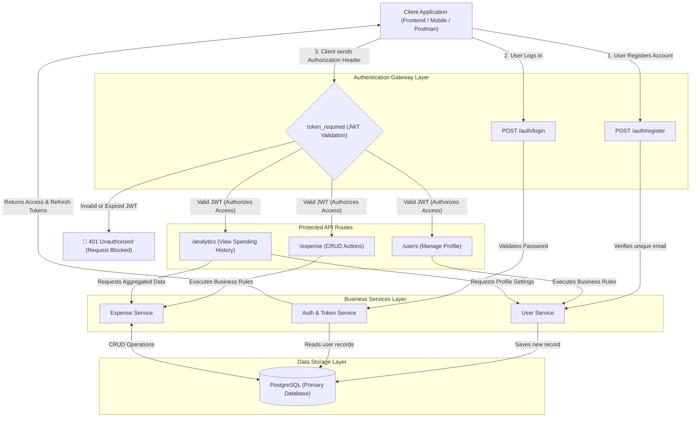

# Expense API - Authentication & Data Flow Architecture

This diagram illustrates how a client application interacts with the backend. It strictly visually enforces that **Authentication happens first**, and all other routes are securely protected behind the Token Validation Middleware.

### Key Architectural Concepts Visualized
1. **The Auth Vault**: Nobody gets past the `Token_Middleware` without a valid, unexpired token. It acts as a strict gateway.
2. **Service Layer Isolation**: The routes (e.g., `/expense`) never interact with PostgreSQL directly. They delegate entirely to the `Service_Layer`.
3. **Caching**: Redis is used strictly at the `Service_Layer` for extremely fast retrieval of monthly budget configurations.
